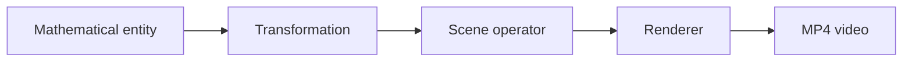
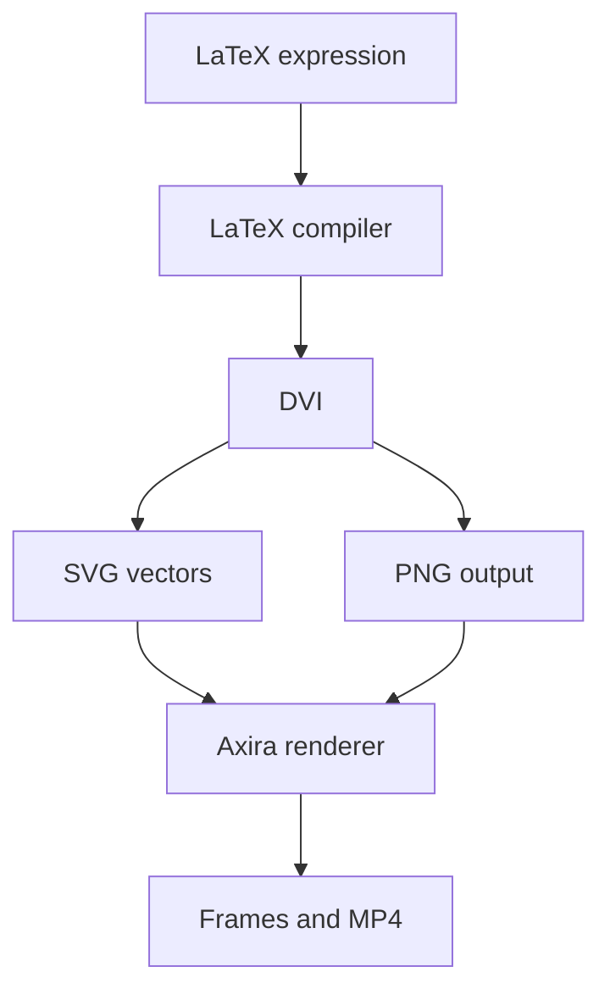

<div align="center">

# ✦ Axira

### Mathematical animation, described as code.

**A declarative Python engine for precise LaTeX animations and video rendering.**

[](https://pypi.org/project/axira/)
[](https://www.python.org/)
[](https://github.com/AnimationsByAxiory/axira/stargazers)
[](https://github.com/AnimationsByAxiory/axira/commits/main)

[Install](#-installation) · [Quick start](#-quick-start) · [CLI](#-command-line) · [Architecture](#-how-axira-thinks) · [Roadmap](#-roadmap)

</div>

---

## What is Axira?

Axira is an independent mathematical animation engine written in Python. It turns structured scene descriptions and real LaTeX typography into rendered video.

Instead of hiding a scene inside a chain of imperative drawing calls, Axira keeps its concepts explicit:

| Concept | Axira representation |
| --- | --- |
| Mathematical expression | `LatexSymbolicMathFunction` |
| Animation | `LatexSymbolicMathWriteFunction` |
| Timing | `TemporalHoldFunction` |
| Execution | `ExecuteSceneOperator` |
| Final result | MP4 video |

This separation gives the engine a clear foundation for richer mathematical objects, transformations and renderers.

> [!IMPORTANT]
> Axira is an early-stage experimental project. The API may change between releases.

## ✨ Highlights

- Genuine LaTeX mathematical typesetting
- Vector-based writing animations
- Declarative Python scene descriptions
- Explicit entities, transformations and timing operations
- SVG and PNG rendering pipeline
- MP4 video generation
- Low, medium, high and 4K quality presets
- Custom output filenames and frame rates
- Cached LaTeX assets for faster repeated renders
- Command-line workflow designed for iteration

## 📦 Installation

Axira requires **Python 3.10 or newer**.

```bash
pip install axira
```

For development:

```bash
git clone https://github.com/AnimationsByAxiory/axira.git
cd axira
python -m pip install -e .
```

### External requirements

LaTeX rendering requires a TeX distribution. On Windows, [MiKTeX](https://miktex.org/) is a convenient option.

These commands must be available in your system `PATH`:

```text
latex
dvisvgm
dvipng
```

Verify the installation:

```bash
latex --version
dvisvgm --version
dvipng --version
```

## 🚀 Quick start

Create `main.py`:

```python
from axira import *


class QuadraticFormula(Scene):
    formula = LatexSymbolicMathFunction(
        LaTeXScalarExpression=(
            r"x=\frac{-b\pm\sqrt{b^2-4ac}}{2a}"
        )
    )

    ExecuteSceneOperator(
        MathPlayTransform=LatexSymbolicMathWriteFunction(
            TargetFunctionEntity=formula,
            duration=4.0,
        )
    )

    ExecuteSceneOperator(
        MathWaitTransform=TemporalHoldFunction(
            DurationScalarMetric=2.0,
        )
    )
```

Render it:

```bash
axira main.py QuadraticFormula -m -o quadratic.mp4
```

Axira loads the scene, executes its operators, renders the LaTeX writing animation and encodes the result as an MP4 video.

## 🎬 Command line

General syntax:

```text
axira <python-file> <scene-name> [options]
```

| Option | Purpose |
| --- | --- |
| `-l` | Low quality — fastest for previews |
| `-m` | Medium quality |
| `-b` | High quality |
| `-k` | 4K quality |
| `-o result.mp4` | Custom output filename |
| `--fps 60` | Custom frame rate |

Examples:

```bash
# Fast preview
axira main.py Demo -l

# High-quality output
axira main.py Demo -b -o result.mp4

# Medium quality at 60 FPS
axira main.py Demo -m --fps 60
```

## 🧠 How Axira thinks

An Axira scene is a structured description of mathematical intent:



For example, an expression exists independently from the animation applied to it:

```python
equation = LatexSymbolicMathFunction(
    LaTeXScalarExpression=r"\int_0^\infty e^{-x^2}\,dx"
)

write = LatexSymbolicMathWriteFunction(
    TargetFunctionEntity=equation,
    duration=3.0,
)

ExecuteSceneOperator(MathPlayTransform=write)
```

Waiting is also an explicit scene operation:

```python
ExecuteSceneOperator(
    MathWaitTransform=TemporalHoldFunction(
        DurationScalarMetric=2.0,
    )
)
```

The renderer preserves the completed scene state for the requested interval.

## ⚙️ Rendering pipeline

Axira uses a real LaTeX toolchain instead of imitating mathematical typography with a regular font.



- **SVG** supplies vector geometry for progressive writing.
- **PNG** supplies the final rasterized appearance.
- **Caching** avoids compiling identical expressions repeatedly.

Generated cache files are stored under `.axira/` and should not be committed.

## 🗺️ Roadmap

Axira is being built from algebra outward. Planned directions include:

- [ ] Multiple objects in one scene
- [ ] Positioning, scaling and rotation
- [ ] Colors and styling
- [ ] Transformations between expressions
- [ ] Coordinate systems and graphs
- [ ] Geometric primitives
- [ ] Camera controls
- [ ] Synchronized animations and easing
- [ ] Text objects and reusable scene components
- [ ] Audio support
- [ ] Improved performance and cross-platform support

Roadmap items describe intended direction, not features already available in the current release.

## 🛠️ Development

```bash
git clone https://github.com/AnimationsByAxiory/axira.git
cd axira
python -m pip install -e .
axira --help
```

Build the package:

```bash
python -m pip install --upgrade build twine
python -m build
python -m twine check dist/*
```

## 🤝 Contributing

Ideas, experiments, bug reports and contributions are welcome.

When reporting a rendering issue, please include:

- operating system and Python version;
- Axira version;
- TeX distribution;
- output of `latex --version`, `dvisvgm --version` and `dvipng --version`;
- complete traceback;
- a minimal scene that reproduces the problem.

[Open an issue](https://github.com/AnimationsByAxiory/axira/issues/new) to share feedback or report a bug.

## Project status

- **Current version:** `1.0.1`
- **Python:** `3.10+`
- **Primary development platform:** Windows
- **Status:** experimental, under active development
- **Package:** [PyPI](https://pypi.org/project/axira/)
- **Source:** [GitHub](https://github.com/AnimationsByAxiory/axira)

## License

A license has not yet been specified. Add a recognized open-source license before encouraging external redistribution or contributions.

---

<div align="center">

Built for mathematics that deserves to move.

**[Explore the code](https://github.com/AnimationsByAxiory/axira)** · **[Install from PyPI](https://pypi.org/project/axira/)** · **[Report an issue](https://github.com/AnimationsByAxiory/axira/issues)**

</div>
